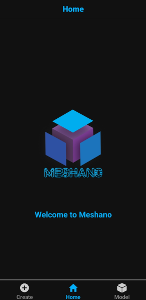

<h1>Meshano App</h1>

    Meshano App is the client side of Meshano graduation project. 
    It's a cross-platform mobile to reconstruct 3D model of an object from its images taken by mobile camera with no special specifications. 
    It is implemented using <a href="https://reactnative.dev">React Native</a> and <a href="https://expo.io/">Expo</a>.

<h2>Screenshots:</h2>

    
    
    
    

    
    
    
    

    
    

<h2>Future Work:</h2>

<li>
Save the reconstructed models</li>
<li>View all created models in the app</li>
